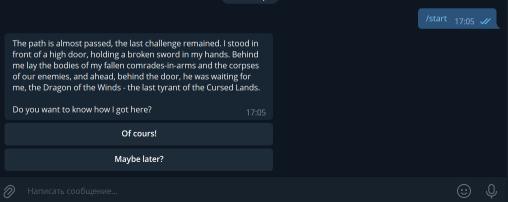
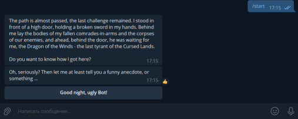
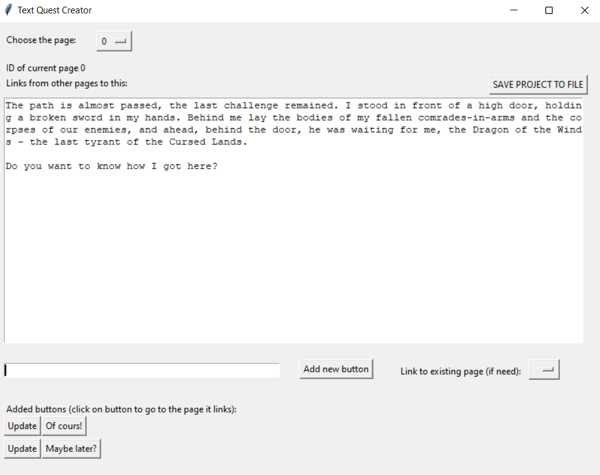

# QUES TEXT BOT FOR TELEGRAM & QUEST CREATOR
A simple but reliable telegram bot for text quests with a utility for creating quests.
- - - - - -
## Bot instructions
To create a bot, go to Telegram app, type "@BotFather" in the search bar and follow the instructions. There you will receive a special token, which should be copied and pasted into the file "config.py" in brackets next to TOKEN. Then you can start the game by running the file in the Python software environment.
The program uses a specially prepared file for the game - "data.json" which you can create by running "quest_writer.py" file.
## Quest creator instructions

The first time you run the program, it will automatically create and place the game data file, and you will be able to start writing the first page right away.   
Type something into the large input field, this will be the body text of your page.  
To add buttons to the page, use the form on the bottom of the window. If you specify a link to an existing page next to the "Add new button" button, the button will lead to it, otherwise a new page will be created and the button will lead to it. If you click on the created button, you will be taken to the page to which this button links. You can go to any page of the quest by clicking on its number in the list above.  
Click on the "SAVE PROJECT TO FILE" button to save all data to a file. You can save to a file right before finishing work. Until then, all intermediate changes will be stored in the program's memory until you save or close the program.  
Author wishes you successes in your work! Let's do some nice content!

